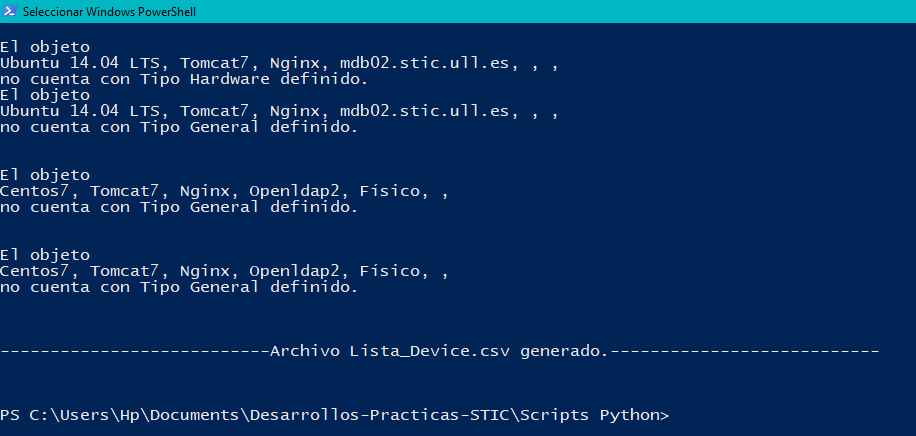
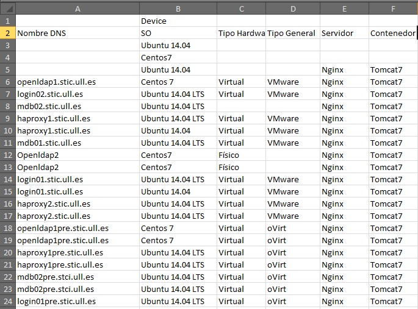

# Script de creación de csv universal

[Enlace al archivo.](https://github.com/alu0100885453/Desarrollos-Practicas-STIC/blob/master/Scripts%20Python/script_generacion_csv_general.py)

Con este Script **Python** crearemos un archivo .csv con la información de todos los objetos que coincidan con el pasado por parámetro en la linea de comandos, extrayendo las propiedades de los objetos Archimate del [modelo Archimate](https://github.com/alu0100888041/Archimate), basándonos en las librerías de lectura de .xml.

Por pantalla nos indicará aquellos objetos que carezcan de alguna propiedad compartida por sus iguales. 

Tendremos que indicar en la linea de comandos el tipo de objeto cual queramos obtener el listado de propiedades.

`$ py script_generacion_csv_general.py tipo_de_objeto`

Por ejemplo, para obtener el listado de servidores:

`$ py script_generacion_csv_general.py Device`

Un ejemplo de salida por pantalla seria:

Y nos crearía un Lista\_Devices.csv tal que así:

